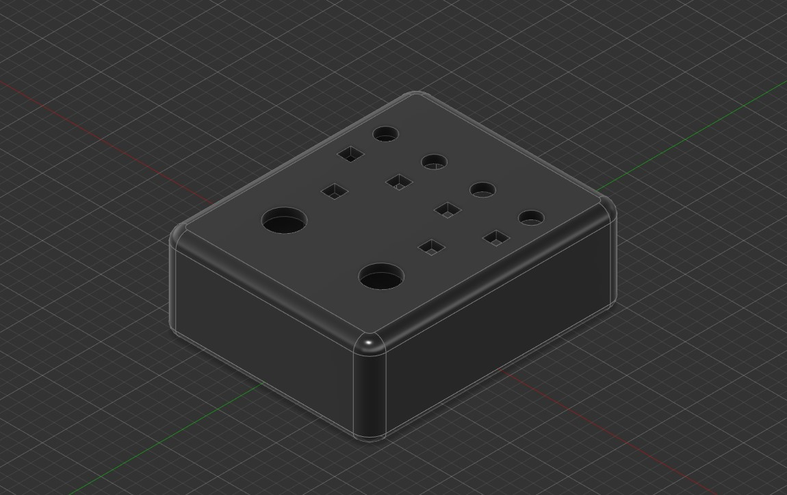
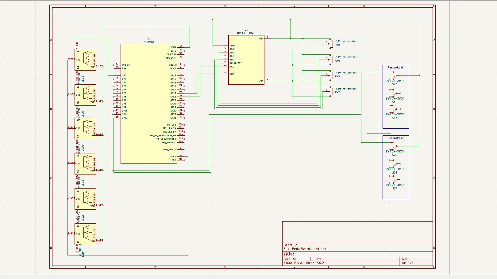

# OSC Pedalboard

This project is designed to create a pedalboard for controlling settings in your DAW (Digital Audio Workstation) using OSC (Open Sound Control) packets. It has been tested with REAPER and the [realearn](https://www.helgoboss.org/projects/realearn/) plugin.

## Raspberry Pi Pico Code

The Raspberry Pi Pico code is located in the `/Code/PiPico/` directory. Please note that the code may crash if there isn't enough space available on the ROM of the Raspberry Pi Pico. To mitigate this, you can use the `mpy_cross_all.py` script to compile the code into `.mpy` files before uploading them to the Pi Pico. You'll need the [compiler](https://github.com/micropython/micropython/tree/master/mpy-cross) for this step.

```bash
python .\mpy_cross_all.py .\PiPico\ -o compiled
```

## 3D Print

The Fusion 360 files for the 3D model are stored in the `/Model/` directory. The two halves of the 3D print need to be printed separately and can then be screwed together after inserting 3M heatset inserts into the top half of the model.



## Circuit

The circuit for the pedalboard requires the following components:

- 2 Stomp Switches
- WS2812B LED Strip
- ADS1115
- 4 100K Potentiometers (Pots)



## Configuration

You can configure the pedalboard via WebSerial by visiting the following URL: [PedalBoard Configuration](https://draguve.github.io/PedalBoard/).

Alternatively, you can configure it via serial communication by sending JSON data like the example below:

```json
{
  "ssid": "<your-ssid>",
  "OSC_Server": "<osc_server_ip>",
  "password": "<your-ssid-pw>",
  "ConnectionAnimationTime": 2,
  "OSC_Port": <osc-port>,
  "Colors": [
    0,
    10000,
    20000,
    30000,
    40000,
    50000,
    60000
  ],
  "LedBrightness": 25,
  "Verbose": false
}
```

You can query the current configuration with the following JSON command:

```json
{"getSettings":true}
```

To check the current WiFi status, use the following JSON command:

```json
{"getWifiStatus":true}
```

Feel free to update the placeholders in the JSON configuration with your actual values.